# 📚 FlashFlicker - AI-Powered Study Platform

<div align="center">
  
  
  
  **Transform Your Learning Experience with AI**
  
  [](https://nextjs.org/)
  [](https://www.typescriptlang.org/)
  [](https://tailwindcss.com/)
  [](https://vercel.com)
  
  [🚀 Live Demo](https://flash-flicker-2mcqiyc4c-epokatrandomstuff-4004s-projects.vercel.app) • [📖 Documentation](#-documentation) • [🎯 Quick Start](#-quick-start) • [🤝 Contributing](#-contributing)

</div>

---

## 🌟 Why FlashFlicker?

FlashFlicker revolutionizes studying by combining **artificial intelligence**, **gamification**, and **modern web technology** into one powerful platform. Whether you're a student, educator, or lifelong learner, FlashFlicker adapts to your learning style and keeps you motivated.

> **"Learning made intelligent, engaging, and effective"**

### 🎯 Perfect For:
- 📚 **Students** preparing for exams and coursework
- 👩‍🏫 **Educators** creating interactive study materials  
- 🎓 **Professionals** mastering new skills and concepts
- 🧠 **Lifelong Learners** exploring new subjects with AI guidance

## ✨ Features That Set Us Apart

<table>
<tr>
<td width="50%">

### 🧠 **AI-Powered Intelligence**
- 🎯 **Smart Flashcard Generation** - Transform any text into interactive flashcards
- 🤖 **Personal AI Study Coach** - Get 24/7 tailored guidance and motivation  
- 📝 **Intelligent Quiz Creation** - Generate custom quizzes from your materials
- 📊 **Content Summarization** - AI-powered insights and key point extraction
- 💡 **Adaptive Learning** - System learns your preferences and improves over time

</td>
<td width="50%">

### 🎮 **Gamified Learning Experience** 
- 🏆 **70+ Achievement Badges** - From "First Steps" to "Study Master"
- ⚡ **XP & Level System** - Earn points and watch your progress grow
- 🔥 **Streak Tracking** - Build daily study habits with streak rewards
- 📈 **Progress Analytics** - Beautiful charts tracking your learning journey
- 🎁 **Surprise Rewards** - Hidden achievements and bonus challenges

</td>
</tr>
<tr>
<td width="50%">

### 📚 **Advanced Study Management**
- ✍️ **Rich Text Notes** - Advanced editor with formatting and organization
- 📱 **Smart Reminders** - Never miss a study session with intelligent notifications
- 📎 **File Import** - Upload PDFs, DOCX, and text files seamlessly  
- 🔍 **Search & Filter** - Find your content instantly across all materials
- 💾 **Auto-Save** - Never lose your work with continuous background saving

</td>
<td width="50%">

### 🎨 **Modern User Experience**
- 🌗 **Dark/Light Themes** - Study comfortably in any lighting condition
- 📱 **Fully Responsive** - Perfect experience on desktop, tablet, and mobile
- ♿ **Accessibility First** - Built following WCAG guidelines  
- ⚡ **Lightning Fast** - Optimized performance with Next.js and Turbopack
- 🎯 **Intuitive Design** - Clean, distraction-free interface focused on learning

</td>
</tr>
</table>

### 🚀 **What Makes FlashFlicker Special?**

| Feature | Traditional Apps | FlashFlicker |
|---------|------------------|--------------|
| **Content Creation** | Manual, time-consuming | AI-generated in seconds |
| **Personalization** | One-size-fits-all | Adapts to your learning style |  
| **Motivation** | Basic progress bars | Comprehensive gamification |
| **Study Guidance** | Static content | Interactive AI coaching |
| **Cross-Platform** | Limited functionality | Full-featured everywhere |

## 🚀 Quick Start Guide

### 📋 Prerequisites

Before you begin, ensure you have the following installed:

| Requirement | Version | Download Link |
|-------------|---------|---------------|
| **Node.js** | 20.0.0+ | [nodejs.org](https://nodejs.org/) |
| **Package Manager** | npm/yarn/pnpm | Comes with Node.js |
| **Gemini API Key** | Latest | [Google AI Studio](https://aistudio.google.com/app/apikey) |

### 🛠️ Installation

#### Option 1: Quick Setup (Recommended)
```bash
# Clone and setup in one command
git clone https://github.com/Hamdan772/FlashFlicker.git && cd FlashFlicker && npm install && npm run dev
```

#### Option 2: Step-by-Step Setup
```bash
# 1️⃣ Clone the repository
git clone https://github.com/Hamdan772/FlashFlicker.git
cd FlashFlicker

# 2️⃣ Install dependencies
npm install
# or for faster installs
pnpm install

# 3️⃣ Start development server
npm run dev
```

### 🔑 API Key Setup

FlashFlicker offers flexible API key management:

#### **Method 1: In-App Setup (Easiest)**
1. Open [http://localhost:3000](http://localhost:3000)
2. Click the 🔑 key icon in the navigation bar
3. Enter your [Gemini API key](https://aistudio.google.com/app/apikey)

#### **Method 2: Quick Access Shortcuts**
For testing and demonstrations:
- Type `"owner"` → Full access with all features unlocked
- Type `"judge"` or `"test"` → Evaluation mode with sample data

#### **Method 3: Environment Variable**
```bash
# Create .env.local file
echo "GEMINI_API_KEY=your-api-key-here" > .env.local
```

### 🎯 Your First 5 Minutes

Follow this quick walkthrough to get the most out of FlashFlicker:

```mermaid
graph LR
    A[📝 Create Note] --> B[🤖 Generate Flashcards]
    B --> C[📚 Take Quiz] 
    C --> D[💬 Chat with AI Coach]
    D --> E[📊 View Progress]
    E --> F[🏆 Unlock Badges!]
```



1. **📝 Create Your First Note**
   - Navigate to `/dashboard/notes`
   - Click "New Note" and add some study content
   - Try uploading a PDF or document for instant import

2. **🤖 Generate Flashcards**
   - Go to `/dashboard/flashcards`
   - Paste any text or upload a file
   - Watch AI create intelligent flashcards in seconds

3. **📚 Take a Quiz**
   - Visit `/dashboard/quizzes`
   - Generate a quiz from your study materials
   - Test your knowledge with AI-created questions

4. **💬 Chat with AI Coach**
   - Head to `/dashboard/coach`
   - Ask questions about your study materials
   - Get personalized study tips and explanations

5. **📊 Track Your Progress**
   - Check `/dashboard/rewards` for your achievements
   - View `/dashboard/data` for detailed analytics
   - Celebrate your growing streak and XP!

## 🚀 Deployment

### Deploy to Vercel (Recommended)

FlashFlicker is optimized for deployment on Vercel:

1. **Push to Git**
   ```bash
   git add .
   git commit -m "Ready for deployment"
   git push origin main
   ```

2. **Connect to Vercel**
   - Visit [vercel.com](https://vercel.com)
   - Import your GitHub repository
   - Vercel will automatically detect the Next.js configuration

3. **Configure Environment Variables** (Optional)
   - In your Vercel dashboard, go to Settings > Environment Variables
   - Add `GEMINI_API_KEY` if you want server-side API key management
   - Otherwise, users can enter their API keys directly in the app

4. **Deploy!**
   - Click "Deploy" and watch your app go live
   - Vercel will provide you with a production URL

### Alternative Deployment Options

| Platform | Configuration | Notes |
|----------|---------------|--------|
| **Netlify** | `netlify.toml` included | Static export compatible |
| **Railway** | `Dockerfile` ready | Full-stack deployment |
| **DigitalOcean** | App Platform compatible | Container-based deployment |
| **Self-hosted** | Docker support | Complete control over infrastructure |

### Environment Variables

| Variable | Required | Description |
|----------|----------|-------------|
| `GEMINI_API_KEY` | No* | Server-side API key (optional - users can enter their own) |
| `NODE_ENV` | Auto | Automatically set by hosting platforms |

*Users can enter API keys directly in the application interface.

## 🌐 Platform Compatibility

<div align="center">

| Platform | Support Level | Minimum Version | Features |
|----------|---------------|-----------------|----------|
| 🖥️ **Desktop Chrome** | ✅ Full Support | 90+ | All features including file upload |
| 🖥️ **Desktop Firefox** | ✅ Full Support | 88+ | Complete functionality |
| 🖥️ **Desktop Safari** | ✅ Full Support | 14+ | All features available |
| 🖥️ **Desktop Edge** | ✅ Full Support | 90+ | Full compatibility |
| 📱 **Mobile Safari** | ✅ Full Support | iOS 14+ | Touch-optimized interface |
| 📱 **Chrome Mobile** | ✅ Full Support | Android 90+ | Complete mobile experience |
| 💻 **PWA Support** | ✅ Available | All browsers | Install as desktop app |

</div>

### 📋 System Requirements
- **RAM**: 4GB minimum (8GB recommended)
- **Storage**: 100MB free space
- **Network**: Broadband connection for AI features
- **Resolution**: 1024x768 minimum (responsive design)

## 🤝 Contributing

We welcome contributions! Here's how to get started:

1. **Fork the repository**
2. **Create a feature branch**: `git checkout -b feature/amazing-feature`
3. **Make your changes** with proper TypeScript types
4. **Run tests**: `npm run typecheck && npm run lint`
5. **Commit your changes**: `git commit -m 'Add amazing feature'`
6. **Push to the branch**: `git push origin feature/amazing-feature`
7. **Open a Pull Request**

### Development Guidelines

- Follow existing code style and conventions
- Add TypeScript types for all new code
- Test your changes thoroughly
- Update documentation as needed
- Ensure all linting passes

## 📄 License

This project is licensed under the MIT License - see the [LICENSE](LICENSE) file for details.

## 🙏 Acknowledgments

- **Google AI** for the powerful Gemini API
- **Vercel** for the amazing Next.js framework
- **Radix UI** for accessible component primitives
- **The open-source community** for all the amazing tools and libraries

## ❓ Troubleshooting & FAQ

<details>
<summary><strong>� Common Issues & Solutions</strong></summary>

### 🔑 API Key Problems
**Problem**: "API key not working" or quota exceeded errors
```bash
# Solutions:
1. Verify key at: https://aistudio.google.com/app/apikey
2. Check usage limits in Google AI Studio
3. Use shortcuts: "owner", "judge", or "test" for demo mode
```

### 💾 Storage Issues  
**Problem**: Notes not saving or data loss
```bash
# Solutions:
1. Check browser storage permissions
2. Clear browser cache and reload
3. Ensure sufficient storage space (>50MB free)
4. Try incognito/private mode to test
```

### 🐛 Performance Issues
**Problem**: Slow loading or AI responses
```bash
# Solutions:  
1. Check internet connection speed
2. Clear browser cache
3. Disable browser extensions temporarily
4. Try a different browser
```

### 📱 Mobile Issues
**Problem**: Features not working on mobile
```bash
# Solutions:
1. Update to latest browser version
2. Enable JavaScript in browser settings
3. Clear mobile browser cache
4. Try desktop version if needed
```

</details>

<details>
<summary><strong>💡 Frequently Asked Questions</strong></summary>

**Q: Do I need an internet connection?**
A: Basic features work offline, but AI functionality requires internet for Google Gemini API.

**Q: Is my data private and secure?**
A: Yes! All data is stored locally in your browser. We never send your personal content to our servers.

**Q: Can I use this for commercial purposes?**  
A: Yes, FlashFlicker is MIT licensed. Perfect for educational institutions and businesses.

**Q: How much does it cost?**
A: FlashFlicker is free! You only pay for your Gemini API usage (very affordable - often under $1/month).

**Q: Can I contribute to the project?**
A: Absolutely! We welcome contributions. Check our [Contributing Guidelines](#-contributing).

**Q: What file formats are supported?**
A: Currently PDF, DOCX, and TXT files. More formats coming soon!

</details>

## 🚨 Known Issues & Roadmap

### 🔄 **Current Limitations**
- File upload limited to 10MB per file
- AI responses may take 3-5 seconds during peak usage
- Bulk operations not yet optimized for 1000+ items

### 🗺️ **Upcoming Features (v2.0)**
- [ ] **Real-time Collaboration** - Study with friends in real-time
- [ ] **Advanced Analytics** - Detailed learning insights and recommendations  
- [ ] **Mobile Apps** - Native iOS and Android applications
- [ ] **Offline AI** - Local AI model for basic functionality
- [ ] **Study Groups** - Community features and shared study spaces
- [ ] **LMS Integration** - Connect with popular learning management systems

## 📞 Support & Community

<div align="center">

### 💬 Get Help & Connect

[](https://github.com/Hamdan772/FlashFlicker/issues)
[](https://github.com/Hamdan772/FlashFlicker/discussions)

</div>

| Support Type | Contact Method | Response Time |
|--------------|----------------|---------------|
| 🐛 **Bug Reports** | [GitHub Issues](https://github.com/Hamdan772/FlashFlicker/issues) | 24-48 hours |
| 💡 **Feature Requests** | [GitHub Discussions](https://github.com/Hamdan772/FlashFlicker/discussions) | 1-3 days |
| 📖 **Documentation** | Check `/docs` folder | Instant |
| 🤝 **Contributing** | See [Contributing Guide](#-contributing) | Varies |

---

<div align="center">

### 🌟 **Show Your Support**

If FlashFlicker helps you learn better, please consider:

[](https://github.com/Hamdan772/FlashFlicker)
[](https://github.com/Hamdan772/FlashFlicker/fork)

**Built with ❤️ by learners, for learners**

Made by [**@Hamdan772**](https://github.com/Hamdan772) | Follow for updates on new features!

*"Education is the most powerful weapon which you can use to change the world." - Nelson Mandela*

</div>

## 🛠️ Development

### Available Scripts

| Command | Description |
|---------|-------------|
| `npm run dev` | Start development server with Turbopack |
| `npm run build` | Build for production |
| `npm run start` | Start production server |
| `npm run lint` | Run ESLint code quality checks |
| `npm run typecheck` | Run TypeScript type checking |
| `npm run genkit:dev` | Start Genkit AI development server |
| `npm run genkit:watch` | Start Genkit with file watching |

### 🔧 API Key Management

FlashFlicker includes a sophisticated API key management system:

- **Secure Storage**: Keys are encrypted and stored locally in your browser
- **Auto-Save**: No need to re-enter your key on each visit
- **Quick Access Shortcuts**: Use predefined shortcuts for testing and demos
- **Validation**: Built-in validation ensures your key is properly formatted

### 🏗️ Architecture

FlashFlicker is built with modern web technologies and best practices:

- **App Router**: Uses Next.js 15's latest app directory structure
- **Server Components**: Optimized performance with server-side rendering
- **Type Safety**: Full TypeScript coverage for robust development
- **AI Integration**: Genkit framework for seamless AI feature development

## 💻 Tech Stack

### Core Framework
- **[Next.js 15.5.4](https://nextjs.org/)** - Full-stack React framework with Turbopack
- **[React 18](https://react.dev/)** - Latest React with concurrent features
- **[TypeScript](https://www.typescriptlang.org/)** - Type-safe development experience

### AI & Backend
- **[Google Gemini AI](https://ai.google.dev/)** - Advanced AI for content generation
- **[Genkit](https://firebase.google.com/products/genkit)** - AI workflow management
- **[Zod](https://zod.dev/)** - Runtime type validation and parsing

### UI & Styling
- **[Tailwind CSS](https://tailwindcss.com/)** - Utility-first CSS framework
- **[Radix UI](https://www.radix-ui.com/)** - Accessible, unstyled UI primitives
- **[Lucide Icons](https://lucide.dev/)** - Beautiful, customizable icons
- **[TipTap](https://tiptap.dev/)** - Rich text editor for notes
- **[Recharts](https://recharts.org/)** - Data visualization library

### Developer Experience
- **[ESLint](https://eslint.org/)** - Code quality and consistency
- **[Prettier](https://prettier.io/)** - Code formatting (implied)
- **Turbopack** - Ultra-fast bundler for development

## 📁 Project Structure

```
FlashFlicker/
├── 📂 src/
│   ├── 📂 app/                    # Next.js App Router
│   │   ├── 📂 dashboard/          # Main dashboard pages
│   │   │   ├── 📂 flashcards/     # Flashcard management
│   │   │   ├── 📂 coach/          # AI study coaching
│   │   │   ├── 📂 quizzes/        # Quiz generation & taking
│   │   │   ├── 📂 notes/          # Note-taking system
│   │   │   ├── 📂 data/           # Progress analytics
│   │   │   └── 📂 rewards/        # Gamification dashboard
│   │   ├── layout.tsx             # Root layout with providers
│   │   └── page.tsx               # Landing page
│   ├── 📂 components/             # Reusable UI components
│   │   ├── 📂 ui/                 # Shadcn/ui component library
│   │   ├── api-key-manager.tsx    # API key management
│   │   ├── rich-text-editor.tsx   # Note editor component
│   │   └── theme-provider.tsx     # Theme management
│   ├── 📂 hooks/                  # Custom React hooks
│   │   ├── use-api-key.tsx        # API key state management
│   │   ├── use-gamification.tsx   # Badge & XP system
│   │   └── use-toast.ts           # Toast notifications
│   ├── 📂 lib/                    # Utility functions
│   │   ├── storage.ts             # Local storage management
│   │   ├── utils.ts               # General utilities
│   │   └── nav-links.ts           # Navigation configuration
│   └── 📂 ai/                     # AI integration layer
│       ├── 📂 flows/              # AI workflow definitions
│       │   ├── generate-flashcards.ts
│       │   ├── generate-quiz.ts
│       │   ├── chat-with-coach.ts
│       │   └── summarize-note.ts
│       └── genkit.ts              # Genkit configuration
├── 📂 docs/                       # Documentation
├── 📄 components.json             # Shadcn/ui configuration
├── 📄 tailwind.config.ts          # Tailwind CSS configuration
├── 📄 next.config.ts              # Next.js configuration
└── 📄 package.json               # Project dependencies
```

## 🎮 Gamification Features

FlashFlicker includes a comprehensive gamification system to keep you motivated:

### 🏆 Achievement System
- **70+ Unique Badges**: From "First Steps" to "Study Master"
- **Category-Based**: Badges for flashcards, quizzes, notes, and more
- **Progressive Unlocking**: Achieve milestones to unlock new challenges

### 📊 Progress Tracking
- **XP System**: Earn experience points for every study activity
- **Level Progression**: Watch your level increase as you learn
- **Streak Counters**: Track daily, weekly, and monthly study habits
- **Visual Analytics**: Beautiful charts showing your learning journey

### 🎯 Special Features
- **Konami Code**: Hidden easter eggs and bonus rewards
- **Time-Based Rewards**: Extra XP for consistent study sessions
- **Social Elements**: Share achievements (coming soon)

## 🤖 AI Capabilities Deep Dive

FlashFlicker leverages Google's powerful Gemini AI to provide intelligent study assistance:

### 🧠 **AI Study Coach Features**
- **Contextual Understanding**: AI analyzes your notes and provides relevant guidance
- **Learning Style Adaptation**: Personalizes explanations based on your preferences  
- **Multi-Subject Expertise**: Covers everything from STEM to humanities
- **Step-by-Step Explanations**: Breaks down complex concepts into digestible parts
- **Interactive Problem Solving**: Guides you through difficult problems with hints

### 📚 **Content Generation Intelligence**
- **Smart Flashcard Creation**: Identifies key concepts and creates targeted questions
- **Difficulty Balancing**: Generates questions appropriate for your learning level
- **Format Recognition**: Adapts to different content types (textbooks, articles, notes)
- **Context Preservation**: Maintains topic coherence across generated materials
- **Quality Assurance**: Built-in validation ensures educational value

### 💡 **Advanced AI Features**
```typescript
// Example AI Integration
const aiCoach = {
  analyze: (content) => extractKeyconcepts(content),
  personalize: (userHistory) => adaptToLearningStyle(userHistory), 
  generate: (prompt) => createEducationalContent(prompt),
  evaluate: (responses) => provideIntelligentFeedback(responses)
}
```

## 🔐 Privacy & Security

Your data privacy is our top priority:

- **🔒 Local Storage**: All personal data stays on your device
- **🛡️ Encrypted API Keys**: Secure key storage with browser encryption
- **🚫 No Data Collection**: We don't collect or store your study content
- **📱 Offline Capable**: Core features work without internet connection
- **🔑 User Control**: Complete control over your data and API usage

## 📊 Performance Metrics

FlashFlicker is built for speed and efficiency:

| Metric | Performance | Industry Standard |
|--------|-------------|-------------------|
| **First Load** | < 2s | < 3s |
| **Page Transitions** | < 100ms | < 500ms |
| **AI Response Time** | 2-5s | 5-10s |
| **Bundle Size** | 136KB gzipped | 200KB+ |
| **Lighthouse Score** | 95+ | 90+ |
